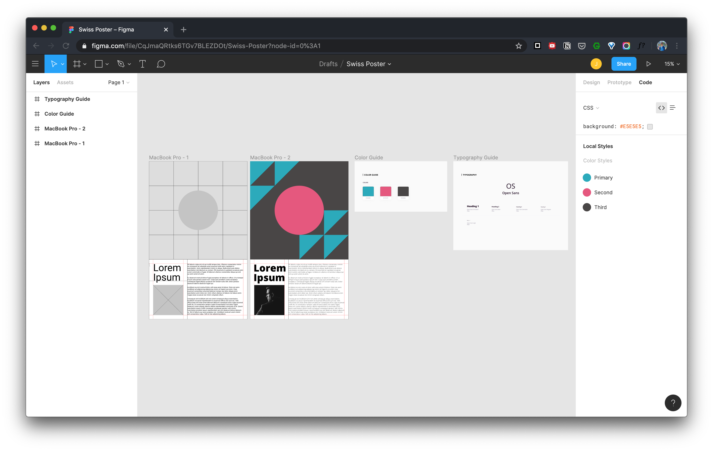
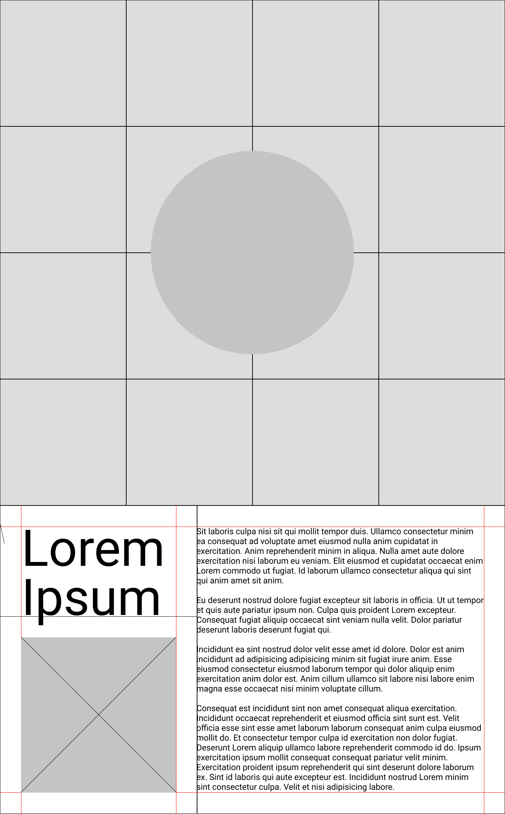
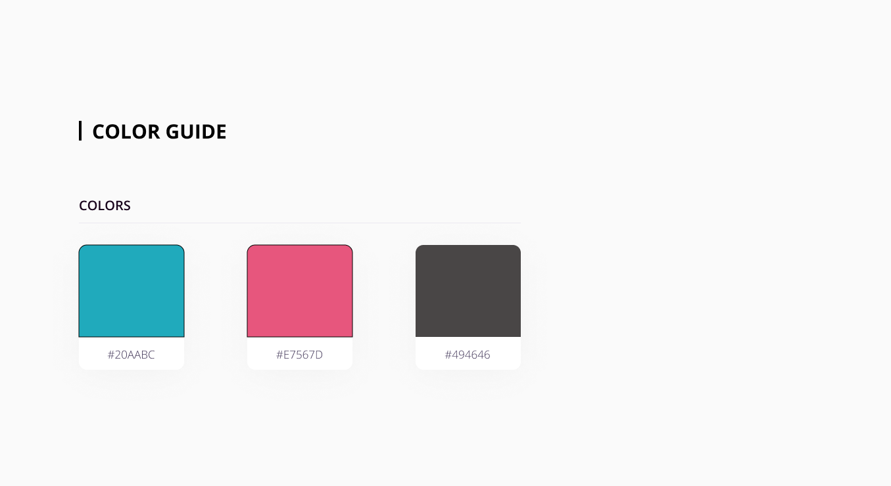
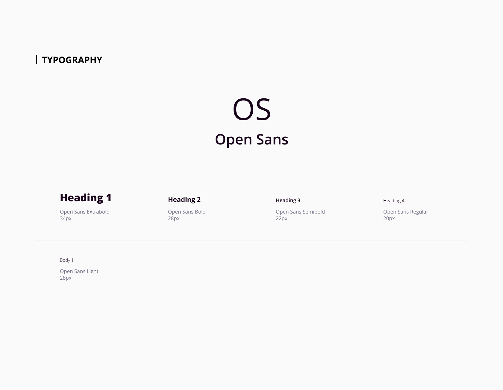
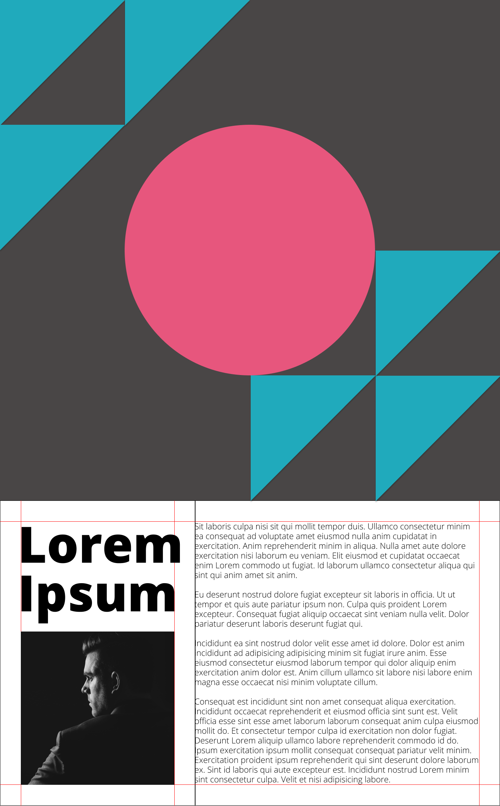

# Swiss Poster Design

This is the week 2 assignemnt for the ITP class Dynamic Web Development.

[Live Demo on Glitch](www.glitch.com)

## Inspiration

I gravitate towards something with an organized grid system. When I was looking at some other people's Swiss Poster Design, this is what I liked the most.

And then I was furthered inspired by the golden ratio, and I think it is also a good idea to apply it in this poster design.

Specifically for the grid system that I am going to build, I think it is reminiscent of a specific kind of puzzle that you rotate each piece to finish the entire picture. Which is essentially called `Spin Puzzle Game`.

## Design

[Project on Figma](https://www.figma.com/file/CqJmaQRtks6TGv7BLEZDOt/Swiss-Poster?node-id=6%3A71)

This is my first time designing UI or layout in Figma. I am a power user of Photoshop, and I did have some experience in using Sketch, from a web developer perspective.

***

Wireframe --> Graphic --> Color Guide --> Typography Guide

***

I started with the Macbook Pro screen resolution and scaled the height with the golden ratio, and kept laying out the grid according to the golden ratio. Then also put a little bit of context into the wireframe.

*My signature color scheme that I use personally very often.*

*Also my favourite font I use for web projects.*

And finally came up with the graphical design of the poster.

