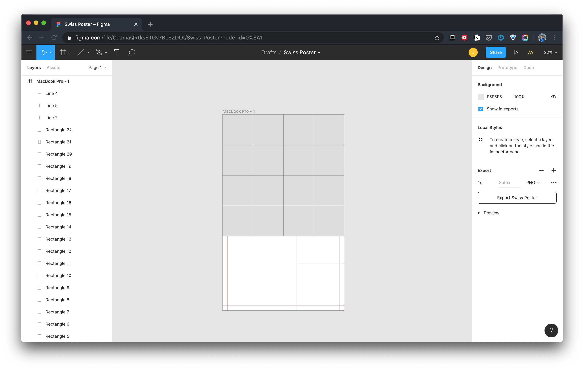

# Swiss Poster Design

This is the week 2 assignemnt for the ITP class Dynamic Web Development.

[Live Demo on Glitch](www.glitch.com)

## Inspiration

I gravitate towards something with an organized grid system. When I was looking at some other people's Swiss Poster Design, this is what I liked the most.


And then I was furthered inspired by the golden ratio, and I think it is also a good idea to apply it in this poster design.


Specifically for the grid system that I am going to build, I think it is reminiscent of a specific kind of puzzle that you rotate each piece to finish the entire picture. Which is essentially called `Spin Puzzle Game`.


## Design

[Project on Figma](https://www.figma.com/file/CqJmaQRtks6TGv7BLEZDOt/Swiss-Poster?node-id=6%3A71)

This is my first time designing UI or layout in Figma. I am a power user of Photoshop, and I did have some experience in using Sketch, from a web developer perspective.


***

Wireframe --> Graphic --> Color Guide --> Typography Guide

***

I started with the Macbook Pro screen resolution and scaled the height with the golden ratio, and kept laying out the grid according to the golden ratio. Then also put a little bit of context into the wireframe.




*My signature color scheme that I use personally very often.*


*Also my favourite font I use for web projects.*

And finally came up with the graphical design of the poster.


## Building the Website

## HTML and CSS

The entire HTML is built with flex boxes, essentially consisting several `row`s and `col`s. As shown, the `top` of the page is a 4 by 4 grid. And the `bottom` of the page is another portion of the golden ratio composition.


Then the right angled triangles are being drawn with a scaled up `border` of two adjacent sides, then hide one side of the two to create the diagonal line.


```CSS
.col-tri{
    border-top: 24vw solid #20AABC;
    border-right: 24vw solid transparent;
}
```

Similarly to the concept applied for triangles, the quartie pies are created with `border-radius`.


```CSS
.col-nw{
    background-color: #494646;
    width: 100%;
    height: 100%;
    border-radius: 100% 0 0 0;
    -moz-border-radius: 100% 0 0 0;
    -webkit-border-radius: 100% 0 0 0;
}
```

To finish up, the `p` and `img` are positioned in the grid with `position: absolute`.

During the entire HTML development, I used `vh` and `vw`. So far this is the easiest way to achieve proportional shapes that are responsive to the window size.

### Adding interactivity with JavaScript

Inspired by the spinning puzzle game, the complete circle, which is formed by 4 quarter pies can be rotated clockwise, 90 degrees at a time to form different patterns. For example a flower.


```js
let angle = [0,0,0,0];
function rotate(i) {
    angle[i.id]++;
    var elem = document.getElementById(i.id);
    var it = setInterval(frame, 10);
    function frame() {
        if ((angle[i.id]%90) == 0 && angle != 0) {
            clearInterval(it);
        } else {
            angle[i.id]++;
            elem.style.transform = "rotate(" + angle[i.id] + "deg)";
        }
    }
}
```

## Struggle

Perhaps its caused by using `vh` and `vw`, sometimes there will be gaps between the triangles and the quarter pies, specifically when the window is being scaled down.

## Reference

[CSS Flexbox](https://www.w3schools.com/css/css3_flexbox.asp)

[Flex Direction](https://css-tricks.com/almanac/properties/f/flex-direction/)

[CSS Quarter Circles](http://jsfiddle.net/mitrosin/xb9edv64/)

[Aspect Ratio Boxes](https://css-tricks.com/aspect-ratio-boxes/)

[onclick Event](https://www.w3schools.com/jsref/event_onclick.asp)

[CSS transform Property](https://www.w3schools.com/cssref/css3_pr_transform.asp)